[原文：Reverse Engineering One Line of JavaScript](https://www.alexkras.com/reverse-engineering-one-line-of-javascript/)

# 一行JavaScript代码的逆向工程

几个月前，我看到一个邮件问：有没有人可以解析这一行 JavaScript 代码

```js
<pre id=p><script>n=setInterval("for(n+=7,i=k,P='p.\\n';i-=1/k;P+=P[i%2?(i%2*j-j+n/k^j)&1:2])j=k/i;p.innerHTML=P",k=64)</script>
```

这一行代码会被渲染成下图的效果。你可以在[这里](https://codepen.io/akras14/pen/yXGzVd)用浏览器打开来观看。这是 Mathieu ‘p01’ Henri 写的，你还可以在作者的网站[www.p01.org](www.p01.org)里看到更多很酷的例子。


好的！我决定接受挑战

## 第一步：让代码变得可读

第一件事，让 HTML 文件里只有 HTML 代码，然后把 JavaScript 代码放到 `code.js` 文件里。我还用 `id="p"` 来包装 pre 标签。

index.html

```js
<script src="code.js"></script>
<pre id="p"></pre>
```

我注意到变量 `k` 只是一个常量，所以把它移出来，然后重命名为 `delay`。

code.js

```js
var delay = 64;
var draw = "for(n+=7,i=delay,P='p.\\n';i-=1/delay;P+=P[i%2?(i%2*j-j+n/delay^j)&1:2])j=delay/i;p.innerHTML=P";
var n = setInterval(draw, delay);
```

接下来，因为 `setInterval` 可以接收一个函数或者字符串来执行，字符串 `var draw` 会被 setInterval 用 `eval` 来解析并执行。所以我把它移到一个新建的函数体内。 然后保留旧的那行代码，以供参考。

我注意到的另一个点，变量 `p` 指向了存在于 HTML 的 DOM 结构里 id 为 `p` 的标签，就是那个之前我包装过的 pre 标签，事实上，元素标签可以通过他们的 id 用 JavaScript 来获取，只要 id 有且只有用字符组成。这里，我通过 `document.getElementById("p")` 来让它更加直观。

```js
var delay = 64;
var p = document.getElementById("p"); // < --------------
// var draw = "for(n+=7,i=delay,P='p.\\n';i-=1/delay;P+=P[i%2?(i%2*j-j+n/delay^j)&1:2])j=delay/i;p.innerHTML=P";
var draw = function() {
    for (n += 7, i = delay, P = 'p.\n'; i -= 1 / delay; P += P[i % 2 ? (i % 2 * j - j + n / delay ^ j) & 1 : 2]) {
        j = delay / i; p.innerHTML = P;
    }
};
var n = setInterval(draw, delay);
```

下一步，我声明了变量 `i`，`p` 和 `j`，然后把他们放在函数的顶部。

```js
var delay = 64;
var p = document.getElementById("p");
// var draw = "for(n+=7,i=delay,P='p.\\n';i-=1/delay;P+=P[i%2?(i%2*j-j+n/delay^j)&1:2])j=delay/i;p.innerHTML=P";
var draw = function() {
    var i = delay; // < ---------------
    var P ='p.\n';
    var j;
    for (n += 7; i > 0 ;P += P[i % 2 ? (i % 2 * j - j + n / delay ^ j) & 1 : 2]) {
        j = delay / i; p.innerHTML = P;
        i -= 1 / delay;
    }
};
var n = setInterval(draw, delay);
```

我把 `for` 循环分解成 `while` 循环。只保留了 `for` 的CHECK_EVERY_LOOP部分（for的三个部分分别是RUNS_ONCE_ON_INIT; CHECK_EVERY_LOOP; DO_EVERY_LOOP），然后分别把其他的代码移到循环的内外部。

```js
var delay = 64;
var p = document.getElementById("p");
// var draw = "for(n+=7,i=delay,P='p.\\n';i-=1/delay;P+=P[i%2?(i%2*j-j+n/delay^j)&1:2])j=delay/i;p.innerHTML=P";
var draw = function() {
    var i = delay;
    var P ='p.\n';
    var j;
    n += 7;
    while (i > 0) { // <----------------------
        //Update HTML
        p.innerHTML = P;

        j = delay / i;
        i -= 1 / delay;
        P += P[i % 2 ? (i % 2 * j - j + n / delay ^ j) & 1 : 2];
    }
};
var n = setInterval(draw, delay);
```

接着我将会展开 `P += P[i % 2 ? (i % 2 * j - j + n / delay ^ j) & 1 : 2]` 当中的三元操作（`判断条件 ？ true时运行 ：false时运行`）

`i % 2` 是用来检测 `i` 是奇数还是偶数，如果 i 是偶数，则返回 2。如果是奇数，则返回 `(i % 2 * j - j + n / delay ^ j) & 1` 的计算结果（更多的是这种情况）。

最终的返回值将作为 P 的下标，然后取出该下标中 P 的值，赋值给字符串 P ，所以它应该写成 `P += P[index]`。

```js
var delay = 64;
var p = document.getElementById("p");
// var draw = "for(n+=7,i=delay,P='p.\\n';i-=1/delay;P+=P[i%2?(i%2*j-j+n/delay^j)&1:2])j=delay/i;p.innerHTML=P";
var draw = function() {
    var i = delay;
    var P ='p.\n';
    var j;
    n += 7;
    while (i > 0) {
        //Update HTML
        p.innerHTML = P;

        j = delay / i;
        i -= 1 / delay;

        let index;
        let iIsOdd = (i % 2 != 0); // <---------------

        if (iIsOdd) { // <---------------
            index = (i % 2 * j - j + n / delay ^ j) & 1;
        } else {
            index = 2;
        }

        P += P[index];
    }
};
var n = setInterval(draw, delay);
```

下一步，我会把 `index = (i % 2 * j - j + n / delay ^ j) & 1` 里的 `& 1` 分解到另外的 if 表达式里

这是一种聪明的方法来检测括号内的值是奇数还是偶数，如果是偶数则返回 0，反之返回 1.`&` 是与的位运算符。与的逻辑如下：

*  1 & 1 = 1
*  0 & 1 = 0

因此 `something & 1` 则可以看成把“something”转化成二进制，接着在 1 的前面填充对应数量的 0，从而保持和 something 的长度一致，然后仅仅返回与运算的最后一位。例如，5的二进制是 `101`。如果我们和 `1` 进行与运算，将会得到如下结果：

``` JavaScript
    101
AND 001
    001
```

或者说，5是一个奇数，`5 & 1` 的结果是 1。用 JavaScript 的控制台很容易可以证明下面这个逻辑。

```js
0 & 1 // 0 - even return 0
1 & 1 // 1 - odd return 1
2 & 1 // 0 - even return 0
3 & 1 // 1 - odd return 1
4 & 1 // 0 - even return 0
5 & 1 // 1 - odd return 1
```

这里可以注意到，我把其中一个 `index` 改名为 `magic`。所以展开 `& 1` 之后的代码看起来是下面这样的。

```js
var delay = 64;
var p = document.getElementById("p");
// var draw = "for(n+=7,i=delay,P='p.\\n';i-=1/delay;P+=P[i%2?(i%2*j-j+n/delay^j)&1:2])j=delay/i;p.innerHTML=P";
var draw = function() {
    var i = delay;
    var P ='p.\n';
    var j;
    n += 7;
    while (i > 0) {
        //Update HTML
        p.innerHTML = P;

        j = delay / i;
        i -= 1 / delay;

        let index;
        let iIsOdd = (i % 2 != 0);

        if (iIsOdd) {
            let magic = (i % 2 * j - j + n / delay ^ j);
            let magicIsOdd = (magic % 2 != 0); // &1 < --------------------------
            if (magicIsOdd) { // &1 <--------------------------
                index = 1;
            } else {
                index = 0;
            }
        } else {
            index = 2;
        }

        P += P[index];
    }
};
var n = setInterval(draw, delay);
```

接下来，我将会分解 `P += P[index]` 到一个 switch 表达式里。现在我们可以很清晰的知道 index 只有可能是 0，1 或者 2 当中的其中一个值。也可以知道 P 的初始化总是 `var P ='p.\n'`， index 为 0 时指向 `p`，为 1 时指向 `.`，为 2 时指向 `\n` - 新的一行字符串。

```js
var delay = 64;
var p = document.getElementById("p");
// var draw = "for(n+=7,i=delay,P='p.\\n';i-=1/delay;P+=P[i%2?(i%2*j-j+n/delay^j)&1:2])j=delay/i;p.innerHTML=P";
var draw = function() {
    var i = delay;
    var P ='p.\n';
    var j;
    n += 7;
    while (i > 0) {
        //Update HTML
        p.innerHTML = P;

        j = delay / i;
        i -= 1 / delay;

        let index;
        let iIsOdd = (i % 2 != 0);

        if (iIsOdd) {
            let magic = (i % 2 * j - j + n / delay ^ j);
            let magicIsOdd = (magic % 2 != 0); // &1
            if (magicIsOdd) { // &1
                index = 1;
            } else {
                index = 0;
            }
        } else {
            index = 2;
        }

        switch (index) { // P += P[index]; <-----------------------
            case 0:
                P += "p"; // aka P[0]
                break;
            case 1:
                P += "."; // aka P[1]
                break;
            case 2:
                P += "\n"; // aka P[2]
        }
    }
};

var n = setInterval(draw, delay);
```

我将简化 `var n = setInterval(draw, delay)`。`setInterval` 会返回一个从 1 开始的整数，并且每次执行完 `setInterval` 之后返回值都会递增。这个整数可以在 `clearInterval` 方法里面用到（用来取消定时器）。在我们的代码里， `setInterval` 仅仅只会执行一次，所以 n 可以简单的设置为 1.

我还把 `delay` 重命名为 `DELAY` 让它看起来是一个常量。

最后一个小点，我用括号把 `i % 2 * j - j + n / DELAY` 包起来使得 `^` 异或运算的执行优先度低于 `%`,`*`,`-`,`+`和`/`操作。或者说，所有的运算操作都会比 `^` 先执行。包装后的代码应该是这样的 `((i % 2 * j - j + n / DELAY) ^ j)`。

```js

// 之前我把 `p.innerHTML = P;` 放错地方了，更新后，把它移出了while循环

const DELAY = 64; // approximately 15 frames per second 15 frames per second * 64 seconds = 960 frames
var n = 1;
var p = document.getElementById("p");
// var draw = "for(n+=7,i=delay,P='p.\\n';i-=1/delay;P+=P[i%2?(i%2*j-j+n/delay^j)&1:2])j=delay/i;p.innerHTML=P";

/**
 * Draws a picture
 * 128 chars by 32 chars = total 4096 chars
 */
var draw = function() {
    var i = DELAY; // 64
    var P ='p.\n'; // First line, reference for chars to use
    var j;

    n += 7;

    while (i > 0) {

        j = DELAY / i;
        i -= 1 / DELAY;

        let index;
        let iIsOdd = (i % 2 != 0);

        if (iIsOdd) {
            let magic = ((i % 2 * j - j + n / DELAY) ^ j); // < ------------------
            let magicIsOdd = (magic % 2 != 0); // &1
            if (magicIsOdd) { // &1
                index = 1;
            } else {
                index = 0;
            }
        } else {
            index = 2;
        }

        switch (index) { // P += P[index];
            case 0:
                P += "p"; // aka P[0]
                break;
            case 1:
                P += "."; // aka P[1]
                break;
            case 2:
                P += "\n"; // aka P[2]
        }
    }
    //Update HTML
    p.innerHTML = P;
};

setInterval(draw, 64);
```

你可以在[这里](https://codepen.io/akras14/pen/qjgrxz)看到最后的结果

## 第二步：理解代码

这部分将会介绍什么内容呢？不要心急，让我们一步一步来解析。

`i` 被初始化为 64（`var i = DELAY`），然后每次循环递减 1/64，等于0.015625（i -= 1 / DELAY）。循环持续到 `i` 小于 0 时（`while (i > 0) {`）。每次执行循环，`i` 将会减少 1/64，所以每执行 64 次循环，`i` 就会减 1 （64 / 64 = 1），总得来说， `i` 需要执行 64 x 64 = 4096 次，之后小于 0.

之前的图片中，一共有 32 行，每行包含了 128 个字符。恰巧的是 64 x 64 = 32 x 128 = 4096。我们触发 32 次 `i` 为严谨的偶数的情况（提示：偶数是整数，所以2.2是奇数），例如 `i` 为 64，62，60等。在这 32 次里，index 被赋值为 2 `index = 2`，意味着字符串将添加 `P += "\n"; // aka P[2]` 从而换行，开始一行新的字符串。剩余的 127 个字符则都是 `p` 和 `.`。

那么我们根据什么来判断何时用 `p` 或者 `.` ?

当然，之前我们就已经知道了，当 `let magic = ((i % 2 * j - j + n / DELAY) ^ j)` 中的 magic 是奇数的时候用 `.` ，如果是偶数则用 `p`。

```js
var P ='p.\n';

...

if (magicIsOdd) { // &1
    index = 1; // second char in P - .
} else {
    index = 0; // first char in P - p
}
```

但我们很难知道 magic 是奇数还是偶数，这是一个很有分量的问题。在此之前，让我们来做些假设。

如果我们把 `+ n/DELAY` 从 `let magic = ((i % 2 * j - j + n / DELAY) ^ j)` 当中移除掉，我们最终将会看到一个静态的布局，如下图

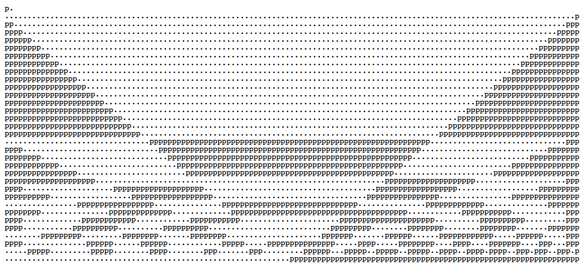

现在，让我们来看看移除了 `+ n/DELAY` 的 `magic`。如何能做到上面的样式。

`(i % 2 * j - j) ^ j`

注意到每次循环里，我们都会执行：

```js
j = DELAY / i;
i -= 1 / DELAY;
```

这里我们可以把 `j` 表达式里的 `i` 替换掉，变成 `j = DELAY/ (i + 1/DELAY)`，但因为 1/DELAY 是一个非常小的数值，所以我们暂时去掉 `+ 1/DELAY` 并简化成 `j = DELAY/i = 64/i`

因此我们可以重写 `(i % 2 * j - j) ^ j` 为 `(i % 2 * 64/i - 64/i) ^ 64/i`

让我们用[在线的图形计算器](https://www.desmos.com/calculator)来绘制那些函数

首先，我们来绘制下 `i%2` 的图

从下面的图形可以看出，y 的值区间在 0 到 2 之间。

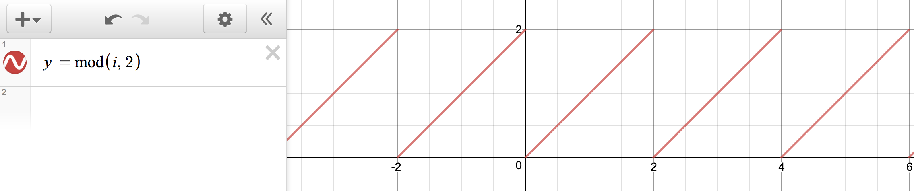

如果我们绘制 `64 / i` 则会得到如下图形

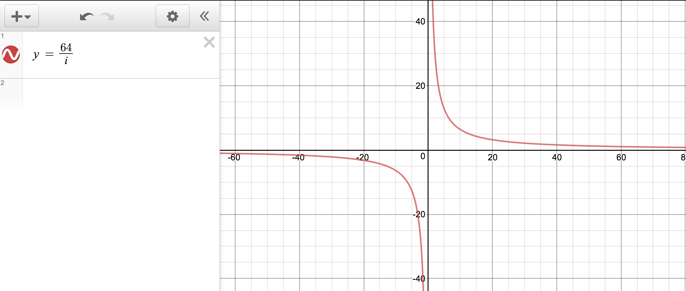

如果我们绘制 `(i % 2 * 64/i - 64/i)` 表达式，我们将得到一个混合了上面两张图的一个图形，如下

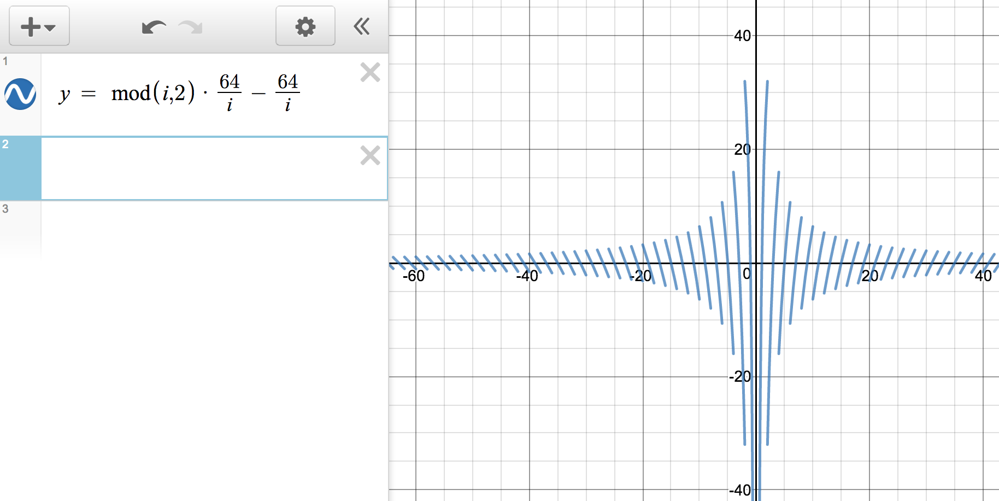

最后，如果我们把2个函数同时绘制出来，将会是如下的图（红线为 `j` 的关系图）

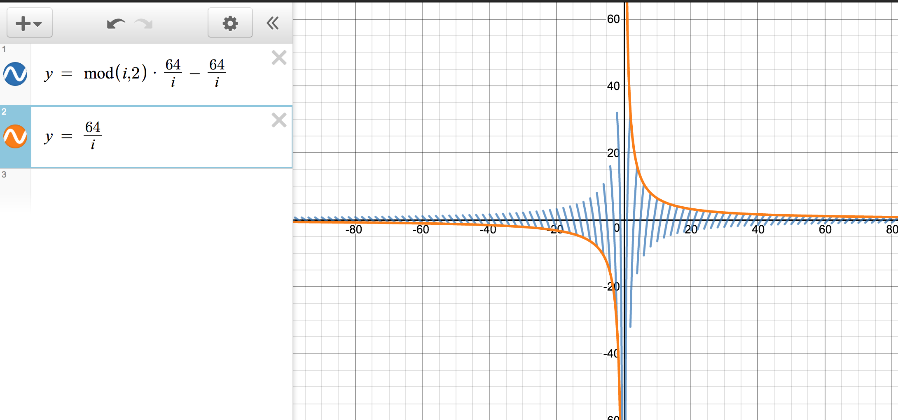

## 我们能从图形里知道些什么？

让我们回忆下我们要去解答的问题：如何得到如下静止图像：


好的，我们知道如果 `(i % 2 * j - j) ^ j` 的值是一个偶数，那么我们将添加 `p`，如果是一个奇数则添加 `.` 。

让我们专注在图形的前面 16 行，`i` 的值在 64 到 32 之间

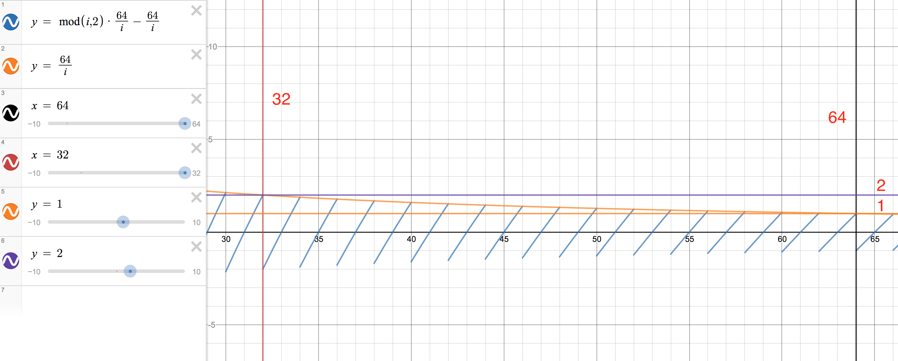

异或运算在 JavaScript 里会把小数点右边的值忽略掉，所以它看起来和执行 `Math.floor` 的效果一样。

其实当2个对比位都是 1 或者 0 的时候, 异或操作会返回0。

这里我们的 `j` 初始值为 1，且慢慢的递增趋向于 2，但始终小于 2，所以我们可以把它当成 1 来处理（`Math.floor(1.9999) === 1`），为了得到结果为 0 （意味着是偶数），我们还需要异或表达式的左边也是 1，使得返回一个 `p` 给我们。

换句话说，每条藏青色的倾斜线都相当于我们图像中的一行，因为前面16行的 `j` 值总是介于 1 和 2 之间，而唯一能得到奇数值的方法是让 `(i % 2 * j - j) ^ j`（也可以说`i % 2 * i/64 - i/64` 或者藏青色的倾斜线）大于 1 小于 -1。

这里展示了一些 Javascript 控制台的输出，0 或者 -2 意味着结果是偶数，1 则是奇数。

```js
1 ^ 1 // 0 - even p
1.1 ^ 1.1 // 0 - even p
0.9 ^ 1 // 1 - odd .
0 ^ 1 // 1 - odd .
-1 ^ 1 // -2 - even p
-1.1 ^ 1.1 // -2 - even p
```

如果我们观察下我们的图形，可以看出原点右边的斜线大部分都是大于 1 或者小于 -1（几乎没有偶数，或者说几乎没有 p），且越靠后（靠近原点）越如此。第 16 行几乎介于 2 和 -2 之间。第 16 行之后，我们可以看到图形换了个模式。

16 行之后 `j` 超过了 2，使得结果发生了变化。现在当藏青色的斜线大于 2 ，小于 -2 ，或者在1和-1之间且不等于的时候，我们将会得到一个偶数。这也是为什么在 17 行之后我们会在一行内看到两组和两组以上的 `p`。

如果你仔细看动图的最底部几行，你会发现这几行不符合上面的规则，图表曲线看起来起伏非常大。

现在让我们把 `+ n/DELAY` 加回来。在代码里我们可以看到 `n` 的初始值是 8 （初始是 1 ，但是每次定时器被调用时就加 7），它会在每次执行定时器时增加 7。

当 `n` 变成 64，图形会变成如下样子。

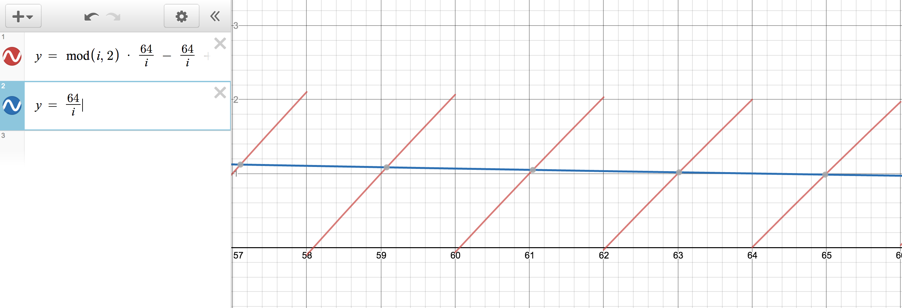

可以注意到，`j` 总是 ~1（这里的 ~ 是近似的意思），但是现在红斜线的左半边位于 62-63 区间的值无限趋近于 0，红斜线的右半边位于 63-64 则无限趋近与 1。因为我们的字符按64到62的顺序排列，那么我们可以猜测斜线的 63-64 部分（1^1=0 是偶数）添加的是一段 `p`，左边 62-63 部分（1^0=1 是奇数）添加的是一段 `.`。就像普通的英语单词一样，从左到右的添加上。

用 HTML 渲染出来的话，将会看到下图（你可以自己在 codepen 改变 `n` 来观看效果）。这和我们的预期一致。

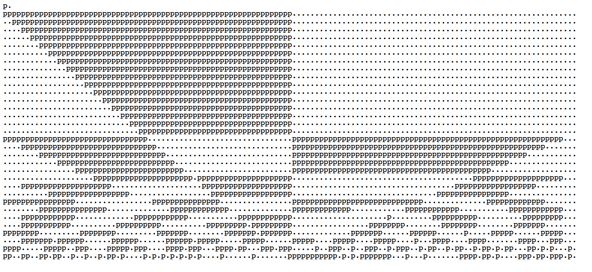

这一时刻 `p` 的数量已经增长了一定的数量。例如第一行里面就有一半的值是偶数，从现在起，一大段的`p` 和 `s` 将移动他们的位置。

为了说明这一点，我们可以看到当 `n` 在下一个定时器里增加了 7 时，图形就会有稍微的变化

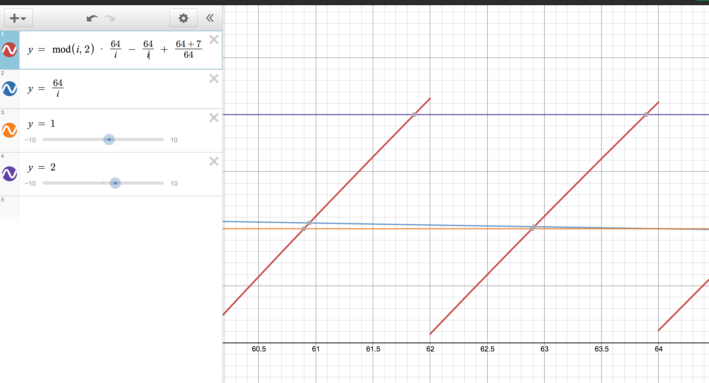

注意，第一行的斜线（在 64 附近）已经稍微移动了 1 小格，假设 4 个方格代表 128 个字符，1 个方格 相当于 32 个字符，那么 1 个小格则相当于 32/5=6.4 个字符（大约）。正如下图所示，我们可以看到第一行实际上向右移动了 7 个字符。

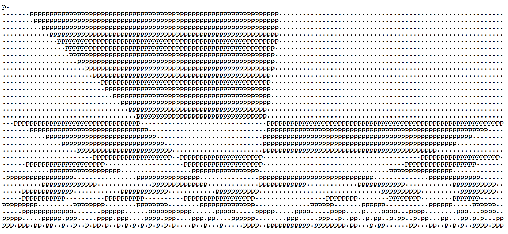

最后一个例子。就是当定时器被调用超过 7 次时（n 等于 64+9x7）会发生什么。

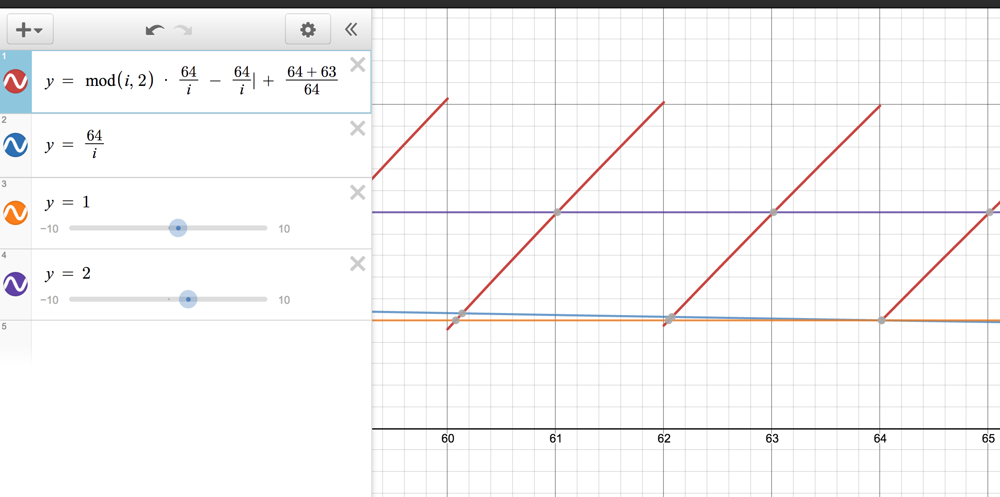

对于第一行，`j` 还等于 1。现在红斜线的上部分在 64 左右的值趋向于 2，下部分趋向于 1。这个图片将会翻转，因为现在 `1^2 = 3 是奇数-输出.` 而 `1^1 = 0 是偶数- 输出p`。所以我们预期在一大段 `p` 之后会是一大段 `.`。

他会这么渲染。


自此，图形将会以这种形式无限循环下去。

我希望我解释清楚了。我不认为自己有能力写出这样的代码，但是我很享受理解它的过程。