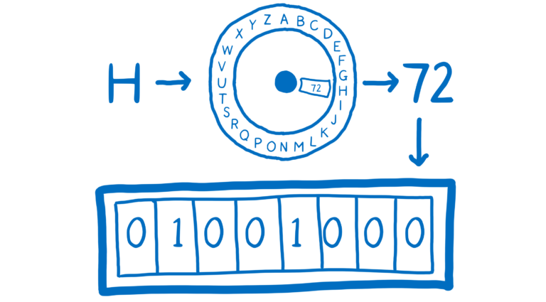
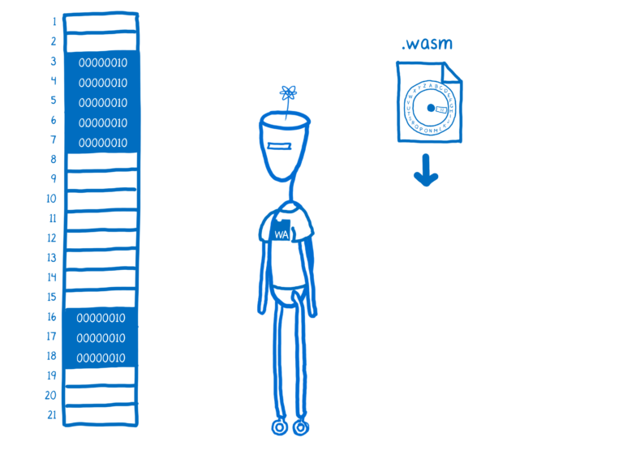

 * 原文地址：[A crash course in memory management](https://hacks.mozilla.org/2017/06/a-crash-course-in-memory-management/)
 * 原文作者：[Lin Clark](https://code-cartoons.com/)
 * 译者：[黑黑](#)
 * 校对者：[Bob](#)

 # 翻译 | 老司机带你秒懂内存管理 - 第一部（共三部）

要理解为什么将 ArrayBuffer 和 SharedArrayBuffer 添加到 JavaScript 中，您需要了解一些关于内存管理的内容。

您可以将机器中的内存看作一堆盒子。就像你在办公室里的邮箱，或是小孩子们使用的收纳箱。

如果你想要为其他孩子留下一些东西，你可以把它放在一个盒子里。

在每个盒子旁边都有一个数字，这些数字就是内存地址，用来告诉别人在哪里找到你留给他们的东西。

这些盒子中的每一个都具有相同的尺寸，并且可以容纳一定量的信息。盒子的尺寸取决于机器。这个大小称为字长。它通常是32位或64位。但是为了显示方便，这里我们使用8位字长。

如果我们想把数字2放在其中一个盒子中，我们可以很容易地做到这一点。数字很[容易转换成二进制](https://www.khanacademy.org/math/algebra-home/alg-intro-to-algebra/algebra-alternate-number-bases/v/decimal-to-binary)。

如果我们想要的东西不是数字怎么办？比如字母 H？

我们需要一个类似[UTF-8](https://en.wikipedia.org/wiki/UTF-8)的编码来用数字代替这些东西。而为了把这些东西转换成数字，我们需要一个类似编码器环的工具。之后我们就可以存储它了。

当我们想把它从盒子里拿出来的时候，必须通过解码器把它转换回 H。

### 自动内存管理
当你在使用 JavaScript 时，实际上并不需要考虑内存。内存被抽象出来，你不会直接接触到它。

取而代之的是 JS 引擎充当中介，为您管理内存。

比如说有一段 JS 代码用来创建一个变量（假设该 JS 代码使用了 React）。

JS 引擎利用编码器把该值转换成二进制。

它将在内存中找到可以容纳该二进制的空间，这个过程称为分配内存。

然后，引擎将跟踪该变量是否仍然可以从程序中的任何地方访问。如果该变量无法再访问，以便 JS 引擎可以在回收的内存中存放新的值。

这种在内存中监控变量（字符串、对象或其他类型）并释放掉不再使用的变量所占用的内存的过程，称为垃圾回收。

像 JavaScript 这样不直接处理内存的语言被称为内存管理语言。

这种自动内存管理可以使开发人员更轻松。但它也增加了一些开销，而这种开销有时会使性能不可预测。

### 手动内存管理

和自动管理内存的语言相比，需要手动管理内存的语言有些不同。例如，我们来看看 React 如何使用 C 语言写入内存（现在可以通过[WebAssembly](https://hacks.mozilla.org/2017/02/a-cartoon-intro-to-webassembly/)来[实现](https://www.youtube.com/watch?v=3GHJ4cbxsVQ)）。

C 语言没有 JavaScript 在内存上的抽象层。而是直接在内存上运行。你可以从内存加载东西，也可以将内容存储到内存中。

当您将 C 语言或其他语言编译到 WebAssembly 时，您使用的工具将在 WebAssembly 中添加一些辅助代码。例如，它会添加用于编码和解码字节的代码。这些代码称为运行环境。运行环境会处理一些本该 JS 引擎做的事情。

但是对于手动管理的语言，其运行时将不包括垃圾回收。

这并不意味着你完全要自己处理。即使在手动内存管理的语言中，通常会从语言运行时获得一些帮助。例如，在 C 语言中，运行时会把哪些内存地址可用记录在一张表中，这张表叫做空闲列表。

您可以使用函数 `malloc` （内存分配的简写）来申请一些可以容纳数据的内存地址。这将把这些地址从空闲列表中拿走。当你处理完这些数据后，你须调用函数 `free` 释放掉由 `malloc` 函数申请的内存。之后，这些地址将被添加回空闲列表。

你必须弄清楚何时调用这些函数。这就是为什么它被称为手动内存管理——你得自己管理内存。

作为一名开发人员，弄清楚何时清除不同部分的内存可能很难。如果您在错误的时间进行操作，可能会出现bug，甚至导致安全漏洞。如果你不这样做，你的内存就会耗尽。

这就是为什么许多现代语言使用自动内存管理的原因——避免人为错误。但这是以性能为代价的。 我将在下一篇文章中更多地解释这一点。