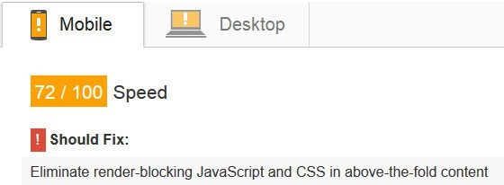
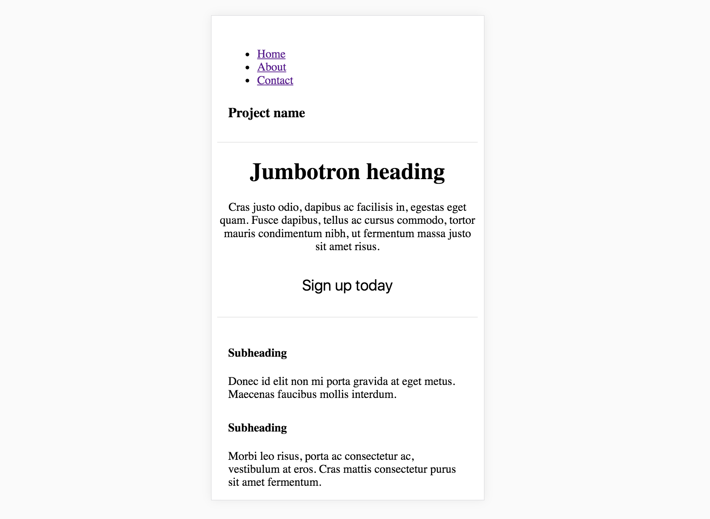
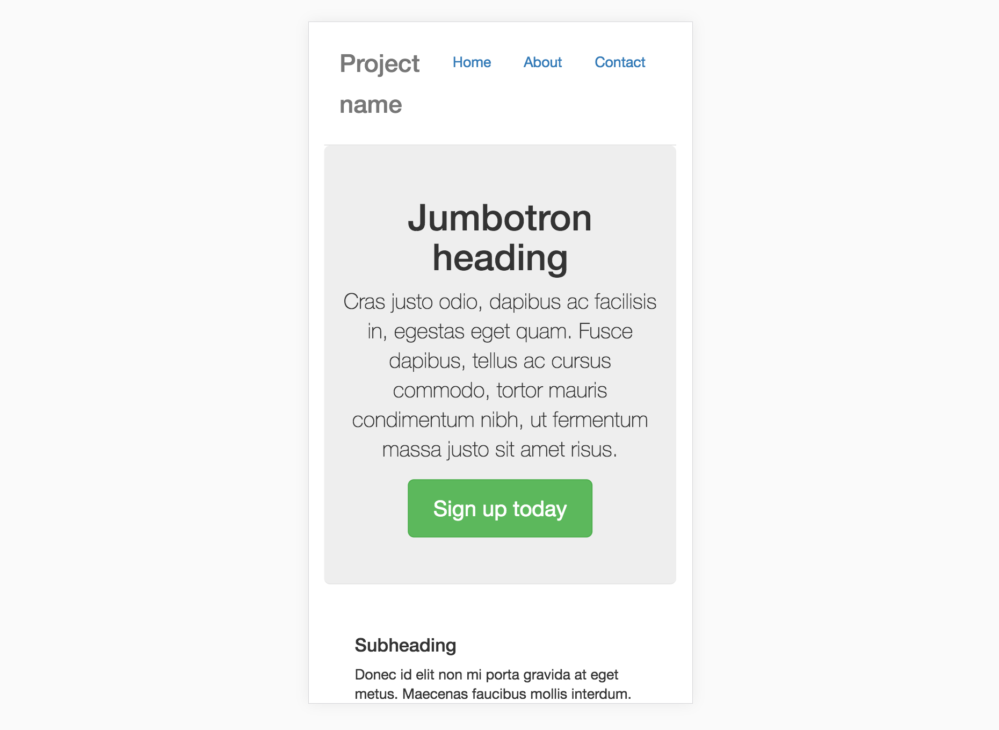
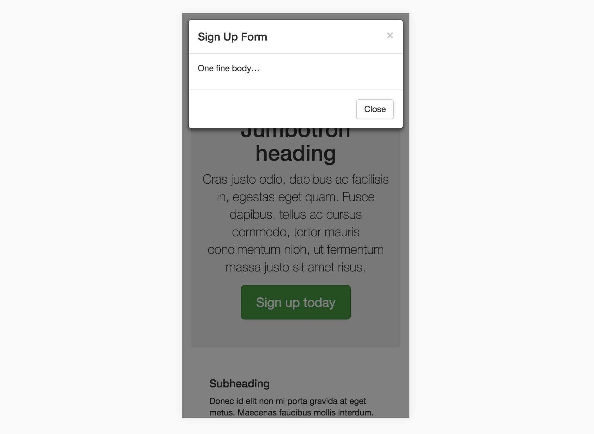
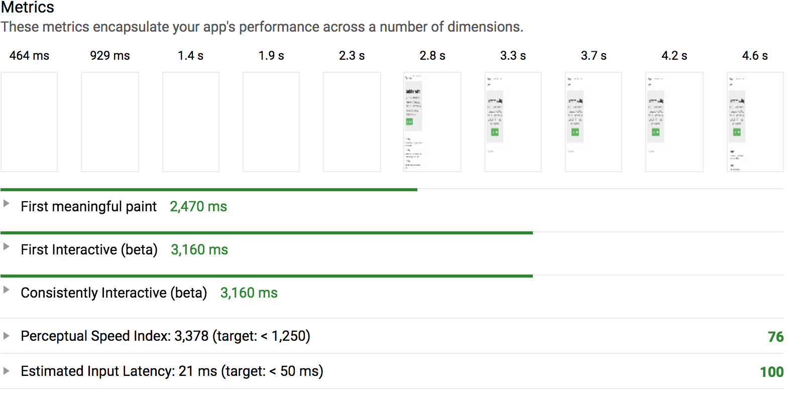
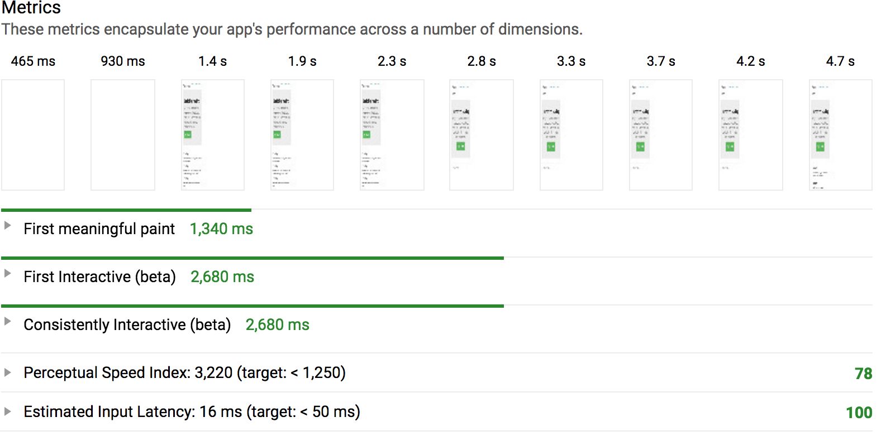

# 翻译 | 关键CSS和Webpack: 减小阻塞渲染的CSS的自动化解决方案


- 原文地址: [Critical CSS and Webpack: Automatically Minimize Render-Blocking CSS](https://vuejsdevelopers.com/2017/07/24/critical-css-webpack/?utm_source=frontendfocus&utm_medium=email)
- 原文作者: Anthony Gore
- 译者: 蜗牛(GivenCui)
- 校对者: veizz

---

"消除阻塞渲染的CSS和JavaScript"。 这一条Google Page Speed Insights的建议总让我困惑。  

当一个网页被访问时，Google希望它仅加载对初始视图有用的内容，并使用空闲时间来加载其他内容。这种方式可以使用户尽可能早地看到页面。    


我们可以做很多事情来减少阻塞渲染的JavaScript，例如code splitting、tree shaking，缓存等。  

但是如何减少阻塞渲染的CSS？为此，可以拆分并优先加载首次渲染所需要的CSS（关键CSS)，然后再加载其它CSS。  

可以通过编程的方式筛选出关键CSS，在本文中，我将向你展示如何通过Webpack的自动化流程来实现该方案。

## 什么是阻塞渲染  

如果资源是“阻塞渲染”的，则表示浏览器在资源下载或处理完成之前不会显示该页面。  

通常，我们在html的`head`标签中添加CSS样式表，这种方式会阻塞渲染，如下所示：  

```
<head>
  <link rel="stylesheet" href="/style.css">
  ...
</head>
<body>
  <p>在style.css下载完之前，你看不到我！！！</p>
</body>
```
当这个html页面被网络浏览器加载时，它将从上到下被逐行解析。当浏览器解析到`link`标签时，它将立即开始下载CSS样式表，在完成之前不会渲染页面。  

对于一个大型网站，尤其是像使用了Bootstrap这种庞大框架的网站，样式表有几百KB，用户必须耐心等待其完全下载完才能看到页面。  

那么，我们是否应该把link标签放到`body`中，以防止阻塞渲染？你可以这么做，但是阻塞渲染也不是全无优点，我们实际上可以利用它。如果页面渲染时没有加载任何CSS，我们会遇到丑陋的"内容闪现"。  
  

我们想要的完美解决方案就应该是：首屏相关的关键CSS使用阻塞渲染的方式加载，所有的非关键CSS在首屏渲染完成后加载。  

## 关键CSS  

这里是我用Webpack和Bootstrap编写的一个简单的网页, 下面的截图是首次渲染后的样式。  

  

点击Sign Up today按钮会弹出一个模态框, 模态框弹出时的样式如下:  

  

首次渲染需要的样式包括导航条的样式、超大屏幕样式、按钮样式、其它布局和字体的公用样式。但是我们并不需要模态框的样式，因为它不会立即在页面中显示。考虑到这些，下面是我们拆分关键CSS和非关键CSS的可能的方式：  

*critical.css*
```
.nav {
  ...
}

.jumbtron {
  ...
}

.btn {
  ...
}
```
*non_critical.css*
```
.modal {
  ...
}
```
如果你已经有这个概念，那么你可能会提出两个疑问：  

1. 我们如何用程序区分关键CSS和非关键CSS?
2. 如何让页面在首次渲染之前加载关键CSS，之后加载非关键CSS？

## 示例项目
我将简要介绍一下这个项目的基本配置，这样我们在遇到解决方案时，方便快速消化。  
首先, 在入口文件中引入Bootsrap SASS。

*main.js*
```
require("bootstrap-sass/assets/stylesheets/_bootstrap.scss");
```
我使用*sass-loader*来处理sass，与*Extract Text Plugin*一起使用，将编译出来的css放到单独的文件中。

使用*HTML Webpack Plugin*来创建一个HTML文件，它引入编译后的CSS。这在我们的解决方案中是必需的，你马上就会看到。  

*webpack.config.js*
```
module.exports = {
  module: {
    rules: [
      {
        test: /\.scss$/,
        use: ExtractTextPlugin.extract({
          fallback: 'style-loader',
          use: ['css-loader', 'sass-loader']
        })
      },
      ...
    ]
  },
  ...
  plugins: [
    new ExtractTextPlugin({ filename: 'style.css' }),
    new HtmlWebpackPlugin({
      filename: 'index.html',
      template: 'index.html',
      inject: true
    })
  ] 
};
```
运行构建之后，这里是HTML文件的样子。请注意，CSS文件在`head`标签里引入，因此将会阻塞渲染。

*index.html*
```
<!DOCTYPE html>
<html lang="en">
<head>
    <meta charset="utf-8">
    <meta name="viewport" content="width=device-width,initial-scale=1">
    <title>vuestrap-code-split</title>
    <link href="/style.css" rel="stylesheet">
</head>
<body>
  <!--App content goes here, omitted for brevity.-->
  <script type="text/javascript" src="/build_main.js"></script>
</body>
</html>
```
## 编程识别关键CSS

手动区分关键CSS维护起来会非常痛苦。以编程方式来实现的话，我们可以使用Addy Osmani的[Critical](https://github.com/addyosmani/critical)。这是一个Node.js模块，它将读入HTML文档，并识别关键CSS。Critical能做的还不止这些，你很快就能体会到。

Critical识别关键CSS的方式如下：指定屏幕尺寸并使用PhantomJS加载页面，提取在渲染页面中用到的所有CSS规则。

以下为对项目的设置:
```
const critical = require("critical");

critical.generate({
  
  /* Webpack打包输出的路径 */
  base: path.join(path.resolve(__dirname), 'dist/'),
  src: 'index.html',
  dest: 'index.html',
  inline: true,
  extract: true,

  /* iPhone6的尺寸，你可以按需要修改 */
  width: 375,
  height: 565,
  
  /* 确保调用打包后的JS文件 */
  penthouse: {
    blockJSRequests: false,
  }
});
```
执行时，会将Webpack打包输出文件中HTML更新为:
```
<!DOCTYPE html>
<html lang="en">
<head>
  <meta charset="utf-8">
  <meta name="viewport" content="width=device-width,initial-scale=1">
  <title>Bootstrap Critical</title>
  <style type="text/css">
    /* 关键CSS通过内部样式表方式引入 */
    body {
      font-family: Helvetica Neue,Helvetica,Arial,sans-serif;
      font-size: 14px;
      line-height: 1.42857;
      color: #333;
      background-color: #fff;
    }
    ...
  </style>
  <link href="/style.96106fab.css" rel="preload" as="style" onload="this.rel='stylesheet'">
  <noscript>
      <link href="/style.96106fab.css" rel="stylesheet">
  </noscript>
  <script>
    /*用来加载非关键CSS的脚本*/
  </script>
</head>
<body>
  <!-- 这里是App的内容 -->
  <script type="text/javascript" src="/build_main.js"></script>
</body>
</html>
```
它还将输出一个新的CSS文件，例如*style.96106fab.css*（文件自动Hash命名）。这个CSS文件与原始样式表相同，只是不包含关键CSS。

## 内联嵌入关键CSS样式
你会注意到，关键CSS已经嵌入到文档的头部。这是最佳的，因为页面不必从服务器加载它。

## 预加载非关键CSS
你还会注意到，非关键CSS使用了一个看起来更复杂的`link`标签来加载。`rel="preload"`通知浏览器开始获取非关键CSS以供之后用。其关键在于，`preload`不阻塞渲染，无论资源是否加载完成，浏览器都会接着绘制页面。

`link`标签中的`onload`属性允许我们在非关键CSS加载完成时运行脚本。*Critical*模块可以自动将此脚本嵌入到文档中，这种方式提供了将非关键CSS加载到页面中的跨浏览器兼容方法。
```
<link href="/style.96106fab.css" rel="preload" as="style" onload="this.rel='stylesheet'">
```

## 把Critical组件添加到webpack打包流程中

我创建了一个名为[HTML Critical Webpack Plugin](https://github.com/anthonygore/html-critical-webpack-plugin)的插件，该插件仅仅是*Critical*模块的封装。它将在*HTML Webpack Plugin*输出文件后运行。

你可以在Webpack的项目中这样引入：

```
const HtmlCriticalPlugin = require("html-critical-webpack-plugin");

module.export = {
  ...
  plugins: [
    new HtmlWebpackPlugin({ ... }),
    new ExtractTextPlugin({ ... }),
    new HtmlCriticalPlugin({
      base: path.join(path.resolve(__dirname), 'dist/'),
      src: 'index.html',
      dest: 'index.html',
      inline: true,
      minify: true,
      extract: true,
      width: 375,
      height: 565,
      penthouse: {
        blockJSRequests: false,
      }
    })
  ] 
};
```
> 注意：你应该只在生产版本中使用，因为它将使你的开发环境的构建很慢

## 表现结果

现在已经抽离了关键CSS，并且把非关键CSS的加载放到空闲时间，这在性能方面会有怎样的提升呢?

我使用Chrome的Lighthouse扩展插件进行测试。请记住，我们尝试优化的指标是[“首次有效绘制”](https://developers.google.com/web/tools/lighthouse/audits/first-meaningful-paint)，也就是用户需要多久才能看到真正可浏览的页面。

**不使用区分关键CSS技术的表现**



**使用区分关键CSS技术的表现**



正如你所看到的，我的应用程序First Meaningful paint时间缩短了将近1秒，到达可交互状态的时间节省了0.5秒。实际中，你的应用程序可能无法获得如此惊人的改善，因为我的CSS很笨重（我包含了整个Bootstrap库），而且在这样一个简单的应用程序中，我没有很多关键CSS规则。
